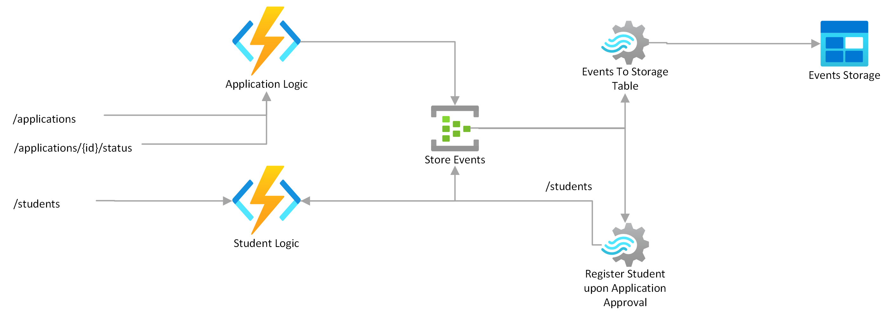

# Spring boot serverless student application with Azure Functions and Event Hub


## What are we doing here ?

- Create Azure Components via Terraform (Resource Group, Storage, Azure Functions, Stream Analytics)
- Spring Cloud Stream (Azure Event Hub)
- Register student/application via Stream Analytics upon application approval

## What we are not doing here.
- Covering dual writes problem
- Cold start optimization
- Persistent DB Storage (H2 in-memory database)

## Prerequisite
- Azure CLI 2.56.0
- Terraform 1.5.7
- Java 17
- Spring Boot 3.2.2
- Maven 3.9.5

## Create Azure Resources
```bash
# Login to Azure
az login

# Create azure resources
terraform apply

# Deploy Azure Functions
mvn clean install
mvn azure-functions:deploy -pl application
mvn azure-functions:deploy -pl student

# Start streaming jobs
az stream-analytics job start \
  --resource-group student-application-demo \
  --name events-to-table-storage
az stream-analytics job start \
  --resource-group student-application-demo \
  --name register-student-upon-application-approval
```

## Test
```bash
curl -X POST https://application-function.azurewebsites.net/api/applications -d '{"firstname": "dan", "surname": "skora", "courseId": 1}'
curl -X GET https://application-function.azurewebsites.net/api/applications/1
curl -X PATCH https://application-function.azurewebsites.net/api/applications/1/status -d '{"status": "approved"}'
curl -X GET https://student-function.azurewebsites.net/api/students/1